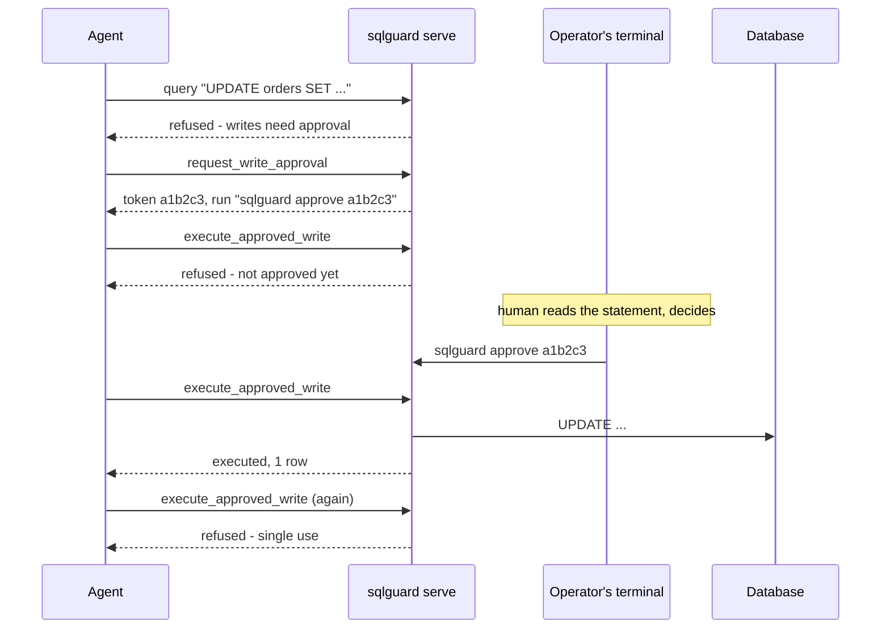

# sqlguard-mcp

[](https://github.com/ahmed-hashim-pro/sqlguard-mcp/actions/workflows/ci.yml) [](https://pkg.go.dev/github.com/ahmed-hashim-pro/sqlguard-mcp) [](LICENSE)

An MCP server that lets an LLM agent query a real database, and refuses anything
it cannot prove is a read.

People want an agent that can answer *"how many orders were refunded last
month"* against the actual data. They do not want it holding write access to
find out. `sqlguard` runs the reads immediately, refuses the writes, and gives
writes a path that ends at a human typing a command in their own terminal.

```
agent: SELECT count(*) FROM orders WHERE status = 'refunded'
       -> 1 row, 3ms

agent: UPDATE orders SET status = 'refunded'
       -> refused: this statement changes rows
          next: call request_write_approval, then ask the operator to approve

agent: SELECT 1; DROP TABLE orders
       -> refused: statement contains more than one statement
```

## Quickstart

Go 1.25+. No database server, no cgo, no API key.

```bash
git clone https://github.com/ahmed-hashim-pro/sqlguard-mcp.git
cd sqlguard-mcp

make build             # -> ./bin/sqlguard
./bin/sqlguard seed ./shop.db
make check             # vet, gofmt and the full suite with -race
```

`seed` writes a small sample shop — customers, orders, order items — from a
schema compiled into the binary, so it needs no `sqlite3` client and no network.

Then point an MCP client at it:

```json
{
  "mcpServers": {
    "sqlguard": {
      "command": "/absolute/path/to/sqlguard-mcp/bin/sqlguard",
      "args": ["serve", "--db", "/absolute/path/to/sqlguard-mcp/shop.db"]
    }
  }
}
```

## The security model

### Reads run. Everything else has to earn it.

| Statement | Decision |
| --- | --- |
| `SELECT`, read-only `WITH`, `VALUES`, `EXPLAIN` of a read | **runs**, under a row cap and a timeout |
| `INSERT`, `UPDATE`, `DELETE`, `REPLACE`, data-modifying CTEs | **refused** until a human approves that exact statement |
| `CREATE`, `DROP`, `ALTER`, `PRAGMA`, `ATTACH`, `VACUUM` | **refused**, always — schema changes are out of scope |
| More than one statement, or any comment | **refused** — either can hide a statement |
| Anything else | **refused** — it was not proved to be a read |

### Ambiguity is a refusal

The classifier never fully parses SQL. Engine-accurate parsers are
engine-specific and the good ones need cgo, which would cost the zero-setup
install. A conservative classifier that refuses what it cannot prove is a read
has a smaller failure surface than a parser that is wrong in ways nobody has
enumerated.

So a statement is a read only when it **starts** like one *and* contains no
write or DDL keyword. That ordering is the whole point:

```sql
WITH gone AS (DELETE FROM orders RETURNING *) SELECT * FROM gone
```

That begins with `WITH` and would pass any check keyed on the first word. It
deletes every row. Keywords are matched against bare words from a scan that
skips quoted sections, so `SELECT 'DELETE FROM orders'` is a read — the verb is
data — and `deleted_at` is one identifier rather than a verb.

### The engine enforces it too

Reads go through a connection opened `query_only(1)`. If a write ever reached
the read path, SQLite refuses it. The classifier and the engine both have to
fail for a write to land there, which turns a classifier bug into a contained
failure rather than an exploited one. There is a test that fires `DELETE`,
`UPDATE`, `INSERT` and `DROP` at the read connection and asserts the row count
is unchanged.

### Approval arrives on a channel the agent does not control



Three properties make this a boundary rather than a formality:

- **There is no tool that approves.** The agent has five tools and none of them
  grants anything. Approval happens in a different process, started by a human.
  A protocol-level test asserts no such tool is advertised, so adding one later
  fails the build.
- **An approval is bound to its statement, not to a capability.** The token
  records a fingerprint of the statement; redemption recomputes it. A token
  granted for `UPDATE orders SET status='paid' WHERE id=1` cannot be spent on
  the same statement with the predicate removed.
- **An approval is single-use, across processes.** That rests on `O_EXCL`
  rather than a mutex — the server and the CLI are different programs, so a
  mutex orders nothing between them. An atomic file creation does.

`sqlguard approve` prints the statement before granting. A prompt that does not
show what is being agreed to is a rubber stamp.

### What this does not do

- It is **not a sandbox**. An approved write executes as written.
- Reads are capped at 500 rows and 30s by default, not by cost. A legal `SELECT`
  can still be expensive.
- There is no row- or column-level access control. Anything readable is
  readable.
- SQLite only. The policy layer is engine-agnostic; the driver is not.
- The classifier is conservative, which means it refuses some legitimate reads.
  That is the intended direction to be wrong in.

## Tools

| Tool | Does |
| --- | --- |
| `query` | Run a read. Refuses anything else, and says what would work instead. |
| `list_tables` | Names of the tables. |
| `describe_table` | Columns, types, nullability, primary key. |
| `request_write_approval` | Ask a human to approve one write. Returns a token. |
| `execute_approved_write` | Run a write a human approved. Single use, statement-bound. |

`describe_table` takes a table name, and `PRAGMA` cannot bind parameters.
Rather than escaping the name into SQL, it is matched against the tables that
actually exist and the real one is used, so an attacker-controlled string never
reaches a statement.

## Commands

```
sqlguard serve   --db <path> [--approvals dir] [--audit file]
                 [--max-rows 500] [--timeout 30s] [--approval-ttl 5m]
sqlguard approve <token> [--approvals dir]
sqlguard pending [--approvals dir]
sqlguard seed    <path> [--force]
```

Every decision, allowed or refused, is appended to `audit.jsonl`:

```json
{"at":"2026-09-04T12:00:03Z","tool":"query","statement":"DELETE FROM orders","kind":"write","decision":"refused","reason":"this statement changes rows, and writes are not executed without human approval"}
```

## Layout

```
cmd/sqlguard/        CLI: serve, approve, pending, seed
internal/policy/     statement classification    - no dependencies at all
internal/db/         execution under caps        - read connection is query_only
internal/approval/   tokens, TTL, single use     - O_EXCL, not a mutex
internal/audit/      JSONL decision log
internal/mcpsrv/     the five tools
```

`internal/` is enforced by the Go compiler, not by convention: nothing outside
this module can import these packages.

## Tests

127 tests, no database server and no credentials required.

```bash
make check      # go vet, gofmt -l, go test -race ./...
```

The suite is layered deliberately:

- `internal/policy` is table-driven over ~40 statements, including the ones a
  naive classifier gets wrong.
- `internal/mcpsrv` runs a real MCP client against the server over in-memory
  transports, so it exercises the generated schemas and JSON-RPC.
- `cmd/sqlguard` builds the binary, starts it as a subprocess, and drives the
  whole refuse → request → approve → execute → reuse cycle over stdio.

## Running it on Kubernetes

Deployed, the approval boundary gets stronger rather than just moving: granting
one requires credentials for the cluster, not access to a file. An agent that
reaches the MCP endpoint over the network still cannot approve its own write,
because approving happens in a process it has no way to start.

```bash
make deploy        # build the image, create a kind cluster, install the chart
make k8s-verify    # probes answer, a read runs, a write is refused
```

`make deploy` needs Docker, `kind`, `kubectl` and `helm`. It is idempotent.

```bash
kubectl port-forward svc/sqlguard 8080:8080
# MCP is then at http://127.0.0.1:8080/mcp
```

When the agent asks for a write it gets a token, and this is how it is granted:

```bash
kubectl exec deploy/sqlguard -c sqlguard -- \
  /usr/local/bin/sqlguard pending --approvals /data/approvals

kubectl exec deploy/sqlguard -c sqlguard -- \
  /usr/local/bin/sqlguard approve <token> --approvals /data/approvals
```

Tear down with `make undeploy`, or `make kind-down` for the whole cluster.

### What is in here, and why

```
deploy/Dockerfile     multi-stage build -> distroless, non-root, no shell
deploy/k8s/           plain manifests, for reading
deploy/verify.sh      drives a running deployment; used by make and by CI
chart/                the same thing parameterised, and what you install
```

Both the plain manifests and the chart are kept: the manifests are the readable
reference, the chart is what `make deploy` installs. CI renders and deploys the
chart, so that is the one proven to work.

**The image is 60 MB and has no shell.** `CGO_ENABLED=0` makes that possible —
the SQLite driver is pure Go, so the binary needs no libc and the final stage
can be `distroless`. A process compromised in this container has nothing to
spawn.

**Liveness and readiness are different questions**, and conflating them is the
mistake worth avoiding:

| | asks | points at |
| --- | --- | --- |
| `livenessProbe` | is this process wedged, should I restart it | `/healthz`, which never touches the database |
| `readinessProbe` | can this pod serve traffic right now | `/readyz`, which pings the database |

If liveness checked the database, a volume blip would restart a healthy pod and
turn a brief outage into a crash loop. If readiness did not, a pod that had lost
its volume would stay in the Service's endpoints and fail every request handed
to it. There is a test for each.

**Replicas are pinned at 1, and that is not a placeholder.** SQLite is a
single-writer file on a `ReadWriteOnce` volume; a second replica would fail to
attach rather than share load. For the same reason the update strategy is
`Recreate` — a rolling update would briefly want two pods on one RWO volume.
Scaling this out is a storage-engine change, not a replica-count change.

**The init container is idempotent** because it runs on every pod start. The
image has no shell, so "seed only if the database is absent" cannot be a test in
the manifest; it is `sqlguard seed --if-missing`, with a test asserting a second
run leaves an existing file untouched.

**Requests and limits do different jobs.** Requests are what the scheduler packs
against; limits are what the kernel enforces. Memory limit equals memory request
here, which puts the pod in Guaranteed QoS so it is not first to be evicted when
the node is under pressure.

**The Service is `ClusterIP`.** Reachable from inside the cluster only —
exposing a database gateway to the internet would undo the point of the
approval boundary.

### What this deployment does not do

- **No authentication on the MCP endpoint.** Anything that can reach the Service
  can issue reads. In a real cluster that belongs behind a NetworkPolicy and an
  authenticating proxy; the approval boundary protects writes, not reads.
- **No TLS.** Terminate it at an ingress or a mesh.
- **Single node, single writer.** See the replicas note above.
- **The PVC is deleted by `make undeploy`.** Convenient for a demo, wrong for
  anything real.

## Design decisions

The questions this repo should be able to answer.

### Why not use a real SQL parser?

Three options were on the table. A hand-rolled regex — rejected, because the
failure modes are unenumerable and it would have called the CTE above a read. A
real parser — `pg_query_go` wraps the actual PostgreSQL parser and is the
correct answer for PostgreSQL, but it needs cgo and it is one engine's grammar;
`vitess`'s parser is MySQL's. Either would have made the classifier accurate for
a database this server does not target, and cost the zero-setup install that
makes the repo runnable from a clone.

What is left is a conservative classifier, and the thing that makes it
defensible is the direction it is wrong in. It refuses some legitimate reads —
`SET timezone` is harmless and gets denied — and it never admits a write it
cannot see. A parser is wrong in the other direction whenever the grammar it
implements is not the grammar the engine runs.

The tradeoff is stated rather than hidden: if this ever targets PostgreSQL
seriously, the classifier should become a `pg_query` front end with this one as
the fallback for anything it fails to parse.

### Why three layers instead of one good check?

Classification, engine enforcement, and the approval boundary are independent.
The classifier is the only one that can be subtly wrong — it is heuristic by
construction — so it is the one that gets a second layer under it. Reads run on
a `query_only(1)` connection, which means a misclassified write does not execute;
it hits SQLite's refusal instead. Both have to fail together for a write to land
on the read path.

The approval boundary is not a third check on the same thing. It answers a
different question: not *is this statement a write* but *may this write happen
at all*, and that is not a question a server can answer alone.

### Why `O_EXCL` and not a mutex?

Because the racing parties are separate programs. `sqlguard serve` and
`sqlguard approve` are different processes, so a `sync.Mutex` in one is invisible
to the other. `os.OpenFile(..., O_CREATE|O_EXCL)` is a kernel-level
test-and-set: exactly one creator wins, across processes.

This is worth reading the test for, because the first version of it was wrong.
It raced sixteen goroutines through a single `Store` — and they all queued
behind that store's mutex, so a plain `if req.Redeemed()` check passed cleanly.
The test proved the mutex worked while claiming to prove something else. Racing
sixteen *independent* `Store` values over one directory is what two programs
look like; without `O_EXCL`, nine of them redeem the same approval.

### Why does every refusal carry a next step?

A refusal an agent cannot act on gets retried verbatim, which is how a guardrail
turns into a loop. `query` on a write does not just say no — it names
`request_write_approval` and says a human has to grant it. `execute_approved_write`
distinguishes *not approved yet* (wait) from *statement does not match* (ask for
a new one) from *already used* (ask for a new one), because those need different
behaviour and an agent given one generic error will pick wrong.

### How do you know the tests test anything?

By deleting the code they protect and checking they fail. That habit found two
real problems here.

The concurrency test above is one. The other was `splitSQL`, which carried a
comment asserting that `sample.sql` contains no semicolon inside a string
literal — true, unenforced, and one edit away from silently cutting a statement
in half. A comment cannot hold an invariant, so it became a test.

The end-to-end suite exists for the same reason, and it earned its keep
immediately: it caught that `sqlguard approve <token> --approvals dir` silently
ignored the flag and looked in the default directory. Go's `flag` package stops
parsing at the first non-flag argument. Nothing that called the handlers
directly would ever have seen it — only starting the real binary as a
subprocess did.

### Why deploy it at all?

Because it makes the boundary stronger rather than merely portable.

Run locally, an approval is granted by whoever can write to a directory. That is
already a real separation — the agent cannot reach the environment the server
was started with — but the bar is filesystem access on one machine.

In a cluster it is `kubectl exec`, which means cluster credentials and whatever
RBAC sits in front of them. The agent can now reach the MCP endpoint over the
network from anywhere in the cluster and still cannot start the process that
approves, because that process is not something the network exposes. The
capability the boundary depends on moved from "can write a file" to "is
authorised against the API server", and it moved without the approval code
changing at all — which is the sign it was in the right place already.

What it costs is honest to state: an operator now needs cluster access to
unblock a write, so approving is slower and needs someone who has it. That is
the trade being made, not a side effect.

### Why both plain manifests and a Helm chart?

They are the same deployment twice, which is a duplication worth defending.

`deploy/k8s/` is readable start to finish — no templating, no values indirection,
every decision visible where it is made. It is what someone reads to understand
the deployment, and what this README's explanations point at.

`chart/` is what actually gets installed, because a deployment worth having is
configurable — image tag, storage size, resource limits, the server's own row
cap and approval TTL.

The risk with two copies is that one rots. So CI installs the chart and drives
the running service, *and* runs a server-side dry run against the plain
manifests, which fails if they stop being applyable. Neither path can silently
break. If the duplication ever stops earning that, the manifests should be
generated by `helm template` rather than maintained.

Note what is deliberately *not* a chart value: `replicas`. See
["What is in here, and why"](#what-is-in-here-and-why) — it is a storage
constraint, not a preference, and exposing it would invite someone to set it to
three and get a pod that cannot attach.

### What did deploying it for real catch?

An init container that crash-looped with `Usage of seed: -force`.

The image had been built before the `--if-missing` flag existed, so the manifest
was passing an argument the binary did not know. Every part of that was
individually fine — the manifest was valid YAML, the chart rendered, the flag
worked, the tests passed. Only starting the thing surfaced it.

That is the argument for what CI does here. `helm lint` and `kubectl --dry-run`
check that a manifest is well formed, which is not the question anyone actually
has about a deployment. The `kubernetes` job builds the image, stands up a real
cluster, installs the chart, and then drives the running service: probes must
answer, a read must run, a write must be refused. It exits non-zero if any of
that is untrue.

It is the same instinct as the end-to-end suite that starts the real binary as a
subprocess, one level further out — and it caught a real defect the first time
it ran, which is the only evidence that matters for whether a check is worth its
runtime.

## Why this exists

I had already built an MCP server that handed an agent a local shell. Writing
it made the real problem obvious: an MCP server is a set of capabilities given
to a non-deterministic caller, and the usual answer — document the risk, trust
the operator — does not survive that, because the operator is not the one
choosing when the dangerous call happens.

That server's answer was binary: a tool is on or off, set by an environment
variable. This one is the graded version. Some statements run, some are refused
outright, and some are refused *pending a decision made somewhere the agent
cannot reach*. Getting that last category right is most of the design — which is
why the approval is bound to a statement rather than a capability, why it is
single-use through an atomic filesystem operation rather than a mutex, and why
the thing that grants it is a different process entirely.

It is also my first Go project, which is why the commit history builds it one
package at a time.

## License

MIT — see [LICENSE](LICENSE).
